<!-- .slide:  data-background-image="images/aoc2024.png" -->
<!-- .slide:  data-background-opacity="0.5" -->
<!-- .slide:  data-background-color="black" -->
<!-- .slide:  class="title" -->

# Comment j'ai créé mon langage pour résoudre l'Advent of Code 2024

## Soirée des communautés techniques rennaises - 2025-03-06

---

### A propos

Frédéric Bonnet

[@codinbzh.bsky.social](https://bsky.app/profile/codinbzh.bsky.social)

Software Engineer @ [Alan](https://medium.com/alan)


---

### Flashback


Défi : résoudre l'Advent of Code

---

### Ma vision du Software Craft


<br/>

- Parcours d'apprentissage par la pratique

- Approche itérative et exploratoire

- Fabriquer son maillet => Fabriquer son établi

---

### Ma vision du langage Helena

<div>

<a href="https://github.com/fredericbonnet/helena">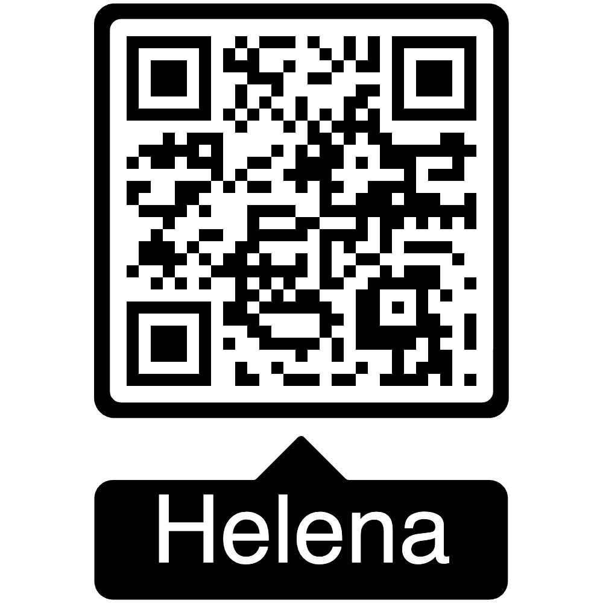</a>
<br/>
<small><a href="https://github.com/fredericbonnet/helena">https://github.com/fredericbonnet/helena</a></small>
</div>

Inspirations : **Tcl**, **Picol**, **Lisp**, Unix shells

- Minimaliste
- Lisible
- Extensible

===

```tcl
# [Tcl syntax]
proc fib {n} {
    if {$n < 0} {error "invalid value"}
    if {$n == 0} {return 0}
    if {$n == 1} {return 1}
    expr {[fib [expr {$n-1}]] + [fib [expr {$n-2}]]}
}
```

```tcl
# [Picol syntax]
proc fib {n} {
    if {< $n 0} {error "invalid value"}
    if {== $n 0} {return 0}
    if {== $n 1} {return 1}
    + [fib [- $n 1]] [fib [- $n 2]]
}
```

```tcl
# [Helena syntax]
proc fib {n} {
    if {$n < 0} {error "invalid value"}
    if {$n == 0} {return 0}
    if {$n == 1} {return 1}
    [fib [$n - 1]] + [fib [$n - 2]]
}
```

---

### Des idées au prototype

- Prototypage en **TypeScript** :

  - Typage + Garbage Collection => pas à se soucier des détails d'implémentation
  - Itérations rapides
  - Refactoring assisté

- Prototype TS = implémentation de référence

- Objectif : portage en C une fois le prototype stabilisé

---

### TDD, Baby Steps et Fast feedback

- Test Suite **Mocha**/**Chai** : ~ 2s pour ~ 3000 tests

- Un changement même simple peut entraîner de gros refactorings : importance du fast feedback et d'une bonne couverture

- POC du cœur validé sur dialecte **Picol**, plus simple

- Conception du dialecte **Helena** une fois le cœur stabilisé => amélioration continue

- **_"TDD Replay"_** : portage itératif en Zig/Go/etc., module par module, test par test

---

### Emerging Design

- **_Specifications as Tests_** : le langage doit être agréable à lire et à écrire

- Certaines idées initiales ont été complètement revues ou abandonnées après mise à l'épreuve des tests

- Certains concepts ont émergé en cours de route : **guards**, **type commands**, **metacommands**...

---

### Living Documentation

- Plan initial : **TSDoc** => pas adapté (je veux la doc du langage, pas de son implémentation)

- **_Specifications as Tests_** => **_Documentation as Tests_** ? (cf. Sébastien Fauvel pour une approche différente)

  - Expérimentations avec **ChatGPT** : pas fiable, échec

  - Utilisation de la suite **Mocha** pour générer la documentation du langage : outil **"Mochadoc"** développé pour l'occasion, génération de pages Markdown à partir du rapport de test

===

```ts
describe("Helena control flow commands", () => {
  mochadoc.meta({ toc: true });

  describeCommand("loop", () => {
    mochadoc.summary("Generic loop");
    mochadoc.usage(usage("loop"));
    mochadoc.description(() => {
      /**
       * The `loop` command is a generic loop that also supports iterating over
       * several sources of values simultaneously.
       */
    });

    mochadoc.section("Specifications", () => {
      specify("usage", () => {
        expect(evaluate("help loop")).to.eql(
          STR("loop ?index? ?value source ...? body")
        );
      });
```

===

<iframe class="r-stretch r-frame" data-src="https://fredericbonnet.github.io/helena/docs/src/helena-dialect/controls.spec.html">

---

### Portage : Adieu C, bonjour Zig

- Nouveau langage, nouveau challenge

- Learning curve modérée même si la doc est limitée

- Environnement plus simple que C, et interopérable

- Gagne en popularité et visibilité avec **Bun**

- Gestion mémoire dynamique moins pénible qu'avec Rust mais toujours manuelle

===

### Echec (temporaire ?) du portage

- Gestion mémoire manuelle, même si les outils de tests aident beaucop
- On peut aller très loin sans garbage collector avec des techniques éprouvées
  - Passage par valeur
  - Comptage de référence
  - Arena allocator
- Mais au bout d'un moment, les références circulaires remettent tous ces choix en cause

---

### Portage : Adieu Zig, bonjour Go

- Nouveau langage, nouveau challenge (bis repetita placent)

- Learning curve simple

- Excellent écosystème : tooling, stdlib, BDD avec Ginkgo et Gomega...

- Gestion mémoire dynamique avec Garbage Collection

---

### Retour d'expérience

- Créer son langage, c'est possible si on s'y prend avec méthode

  - Un minimum de théorie : tokenizer, parser, AST…
  - beaucoup de pratique
  - https://craftinginterpreters.com/ de Bob Nystrom

- Challenges du portage
  1. Nécessité d'une gestion mémoire adaptée (GC)
  2. Taille de la suite de tests
  3. Refactoring permanent et bidirectionnel à mesure que le portage avance

===

### Quelques chiffres

Lignes de code TS

<!--
npx cloc --vcs=git --not-match-f=\\.spec\\.ts src/core
npx cloc --vcs=git --match-f=\\.spec\\.ts src/core

npx cloc --vcs=git --not-match-f=\\.spec\\.ts src/picol-dialect
npx cloc --vcs=git --match-f=\\.spec\\.ts src/picol-dialect

npx cloc --vcs=git --not-match-f=\\.spec\\.ts src/helena-dialect
npx cloc --vcs=git --match-f=\\.spec\\.ts src/helena-dialect
-->

|        | Code  | Tests  | Total  |
| ------ | ----- | ------ | ------ |
| Cœur   | 3.458 | 10.015 | 13.473 |
| Picol  | 516   | 857    | 1.373  |
| Helena | 5.424 | 15.866 | 21.290 |

===

Lignes de code Go

<!--
npx cloc --vcs=git --not-match-f=_test\\.go src/core
npx cloc --vcs=git --match-f=_test\\.go src/core

npx cloc --vcs=git --not-match-f=_test\\.go src/picol_dialect
npx cloc --vcs=git --match-f=_test\\.go src/picol_dialect

npx cloc --vcs=git --not-match-f=_test\\.go src/helena_dialect
npx cloc --vcs=git --match-f=_test\\.go src/helena_dialect
-->

|        | Code  | Tests  | Total  |
| ------ | ----- | ------ | ------ |
| Cœur   | 3.285 | 9.286  | 12.571 |
| Picol  | 658   | 890    | 1.548  |
| Helena | 6.339 | 14.469 | 20.808 |

---

### Démo !

---

## Advent of Code 2024

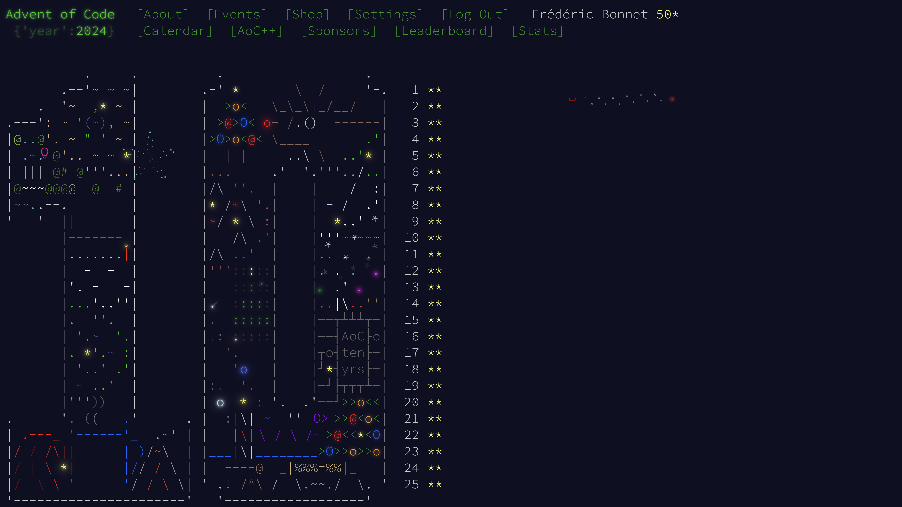

---

### Challenge : les performances !

<a href="https://github.com/fredericbonnet/adventofcode2024">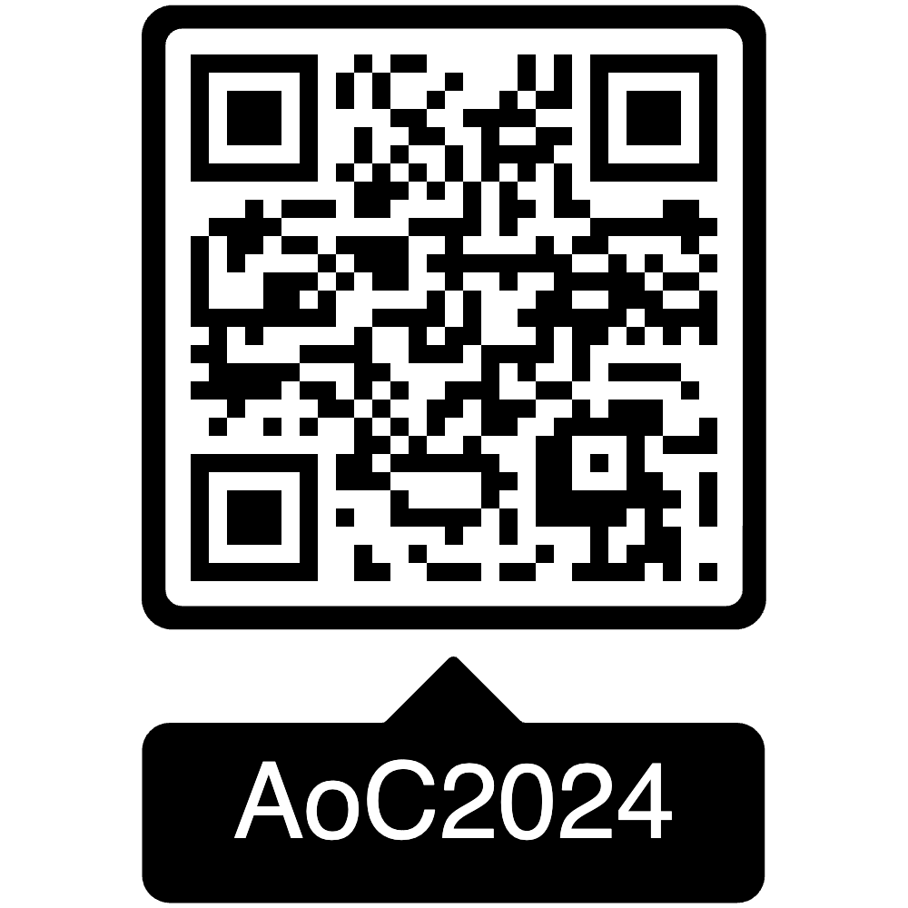</a>

L'Advent of Code se distingue par l'importance des algorithmes et des structures de données

- Phase 1 : algorithmes naïfs ou brute force
- Phase 2 : explosion combinatoire

---

### Mon langage va-t-il exploser ?

- Langage minimaliste
  - Pas de bibliothèque standard
  - Limiter l'apport de code natif au minimum
- Implémentation pas optimisée
  - Oblige à trouver des algorithmes perfomants pour des temps de calculs raisonnables

---

### Résultats

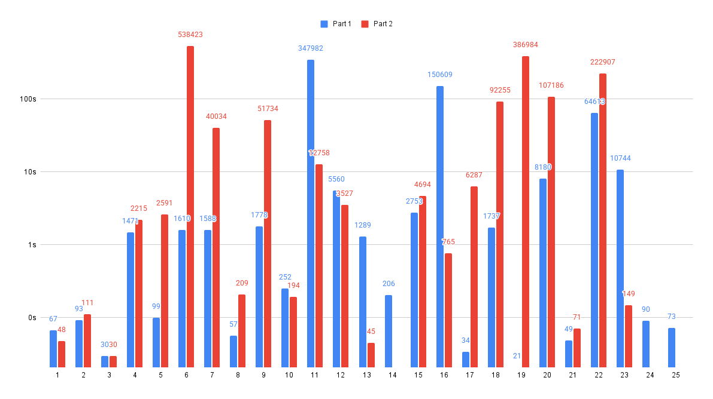

===

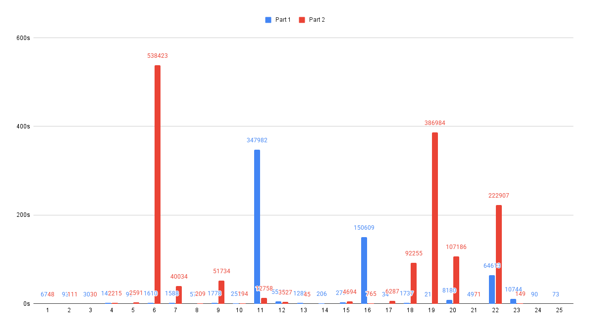

---

### Analyse

- Temps CPU comparables en TS et Go
  - Prépondérance des allocations mémoires : stratégie d'optimisation à privilégier
- Structures de données généralistes peu adaptées à l'exercice
  - `dictionary` affreusement lent à cette échelle
  - Développer des patterns spécifiques au langage
  - De **1h37** à **8min** sur jour 6 partie 2

---

### La mémoire

- La gestion mémoire gomme les différences d'implémentation dans les langages dynamiques
- Les mêmes stratégies donneront des résultats similaires
  - Caching
  - Pooling (Sync.Pool en Go)
  - Pré-allocations
- Mise à profit du tooling Go: pprof
  - Flamegraphs avant/après
  - Micro-optimisations sur benchmarks
  - Wall time sur Advent of Code

===

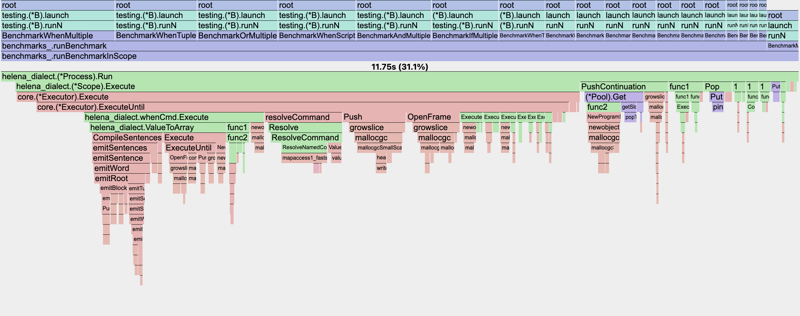
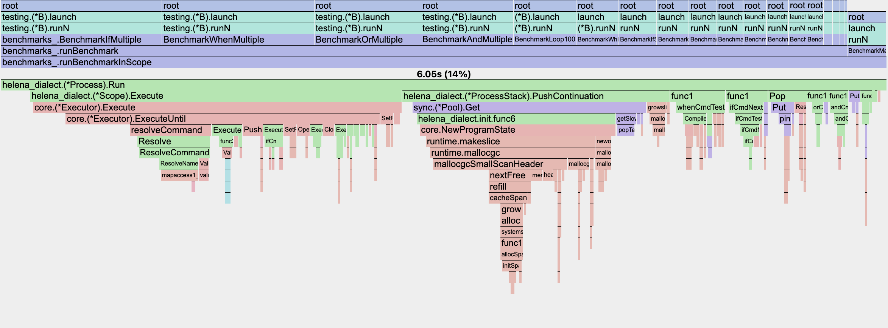

===

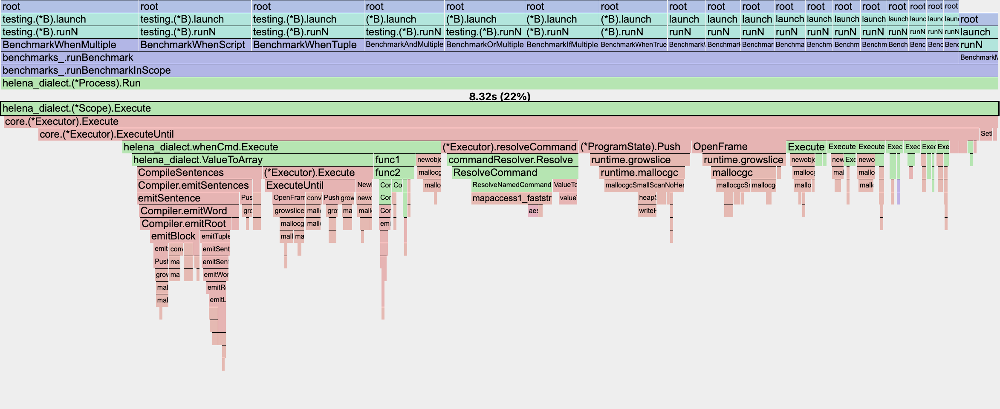
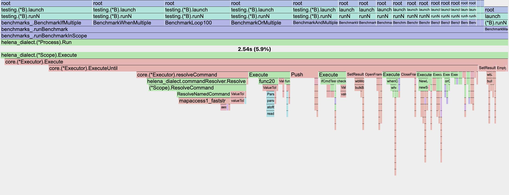

===

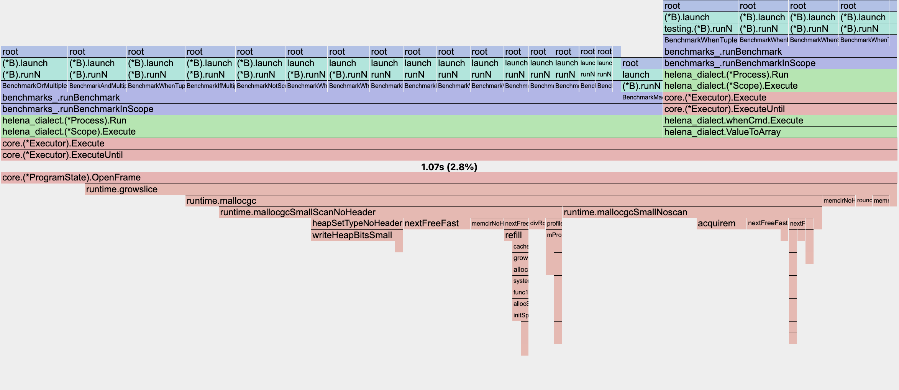
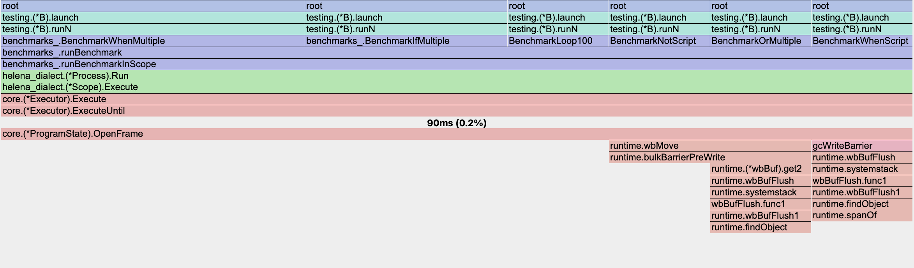

===

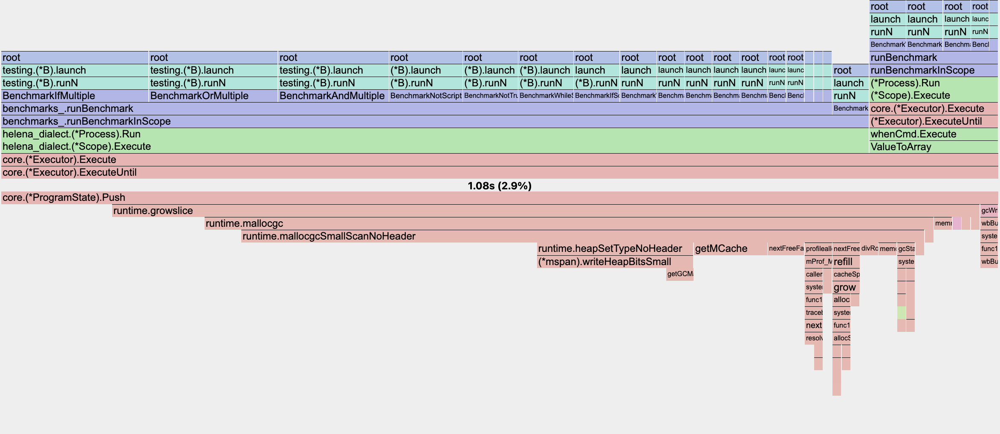
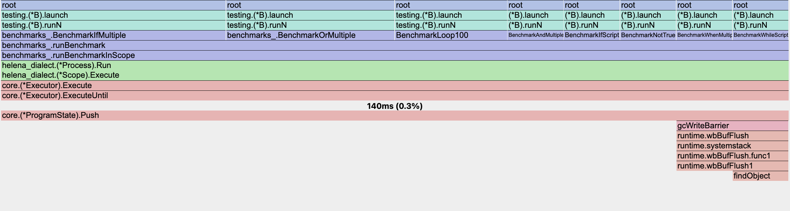

---

### Questions & Echanges

Quel défi pour l'année prochaine ?

A vous de jouer !
