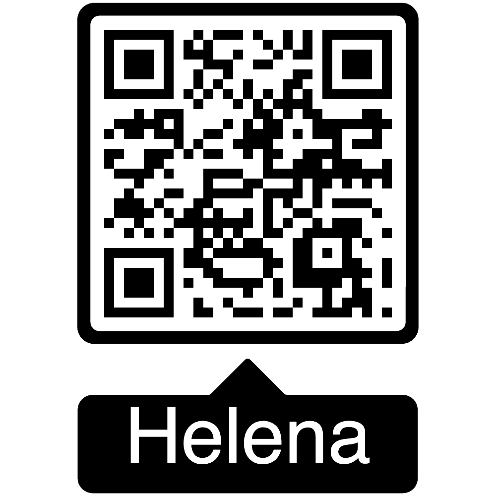

<!-- .slide:  data-background-image="images/dominik-scythe-v8vz-Roj8zo-unsplash.jpg" -->
<!-- .slide:  data-background-opacity="0.5" -->
<!-- .slide:  data-background-color="black" -->
<!-- .slide:  class="title" -->

# Comment j'ai créé mon langage en suivant la philosophie du craft

## Software Crafters Rennes - 2023-12-12

---

### Ma vision du Software Craft


- Parcours d'apprentissage par la pratique

- Approche itérative et exploratoire

- Fabriquer son maillet => Fabriquer son établi

---

### Ma vision du langage Helena

<div>

<a href="https://github.com/fredericbonnet/helena"></a>
<br/>
<small><a href="https://github.com/fredericbonnet/helena">https://github.com/fredericbonnet/helena</a></small>
</div>

Inspirations : **Tcl**, **Picol**, **Lisp**, Unix shells

- Minimaliste
- Lisible
- Extensible

===

```tcl
# [Tcl syntax]
proc fib {n} {
    if {$n < 0} {error "invalid value"}
    if {$n == 0} {return 0}
    if {$n == 1} {return 1}
    expr {[fib [expr {$n-1}]] + [fib [expr {$n-2}]]}
}
```

```tcl
# [Picol syntax]
proc fib {n} {
    if {< $n 0} {error "invalid value"}
    if {== $n 0} {return 0}
    if {== $n 1} {return 1}
    + [fib [- $n 1]] [fib [- $n 2]]
}
```

```tcl
# [Helena syntax]
proc fib {n} {
    if {$n < 0} {error "invalid value"}
    if {$n == 0} {return 0}
    if {$n == 1} {return 1}
    [fib [$n - 1]] + [fib [$n - 2]]
}
```

---

### Des idées au prototype

- Prototypage en **TypeScript** :

  - Typage + Garbage Collection => pas à se soucier des détails d'implémentation
  - Itérations rapides
  - Refactoring assisté

- Prototype TS = implémentation de référence

- Objectif : portage en C une fois le prototype stabilisé

---

### TDD, Baby Steps et Fast feedback

- Test Suite **Mocha**/**Chai** : < 2s pour > 2700 tests

- Un changement même simple peut entraîner de gros refactorings : importance du fast feedback et d'une bonne couverture

- POC du cœur validé sur dialecte **Picol**, plus simple

- Conception du dialecte **Helena** une fois le cœur stabilisé => amélioration continue

- **_"TDD Replay"_** : portage itératif en Zig, test par test

---

### Emerging Design

- **_Specifications as Tests_** : le langage doit être agréable à lire et à écrire

- Certaines idées initiales ont été complètement revues ou abandonnées après mise à l'épreuve des tests

- Certains concepts ont émergé en cours de route : **guards**, **type commands**, **metacommands**...

---

### Living Documentation

- Plan initial : **TSDoc** => pas adapté (je veux la doc du langage, pas de son implémentation)

- **_Specifications as Tests_** => **_Documentation as Tests_** ? (cf. Sébastien Fauvel pour une approche différente)

  - Expérimentations avec **ChatGPT** : pas fiable, échec

  - Utilisation de la suite **Mocha** pour générer la documentation du langage : outil **"Mochadoc"** développé pour l'occasion, génération de pages Markdown à partir du rapport de test

---

### Portage : Adieu C, bonjour Zig

- Nouveau langage, nouveau challenge

- Learning curve modérée même si la doc est limitée

- Environnement plus simple que C, et interopérable

- Gagne en popularité et visibilité avec **Bun**

- Gestion mémoire dynamique moins pénible qu'avec Rust mais toujours manuelle

---

### Retour d'expérience

- Créer son langage, c'est possible si on s'y prend avec méthode

  - Un minimum de théorie : tokenizer, parser, AST…
  - beaucoup de pratique
  - https://craftinginterpreters.com/ de Bob Nystrom

- Challenges du portage Zig
  1. Gestion mémoire manuelle => explorer les alternatives avec garbage collection (Java, C#, Go...)
  2. Taille de la suite de tests
  3. Refactoring permanent et bidirectionnel à mesure que le portage avance

===

### Quelques chiffres

Lignes de code TS

|        | Code  | Tests  | Total  |
| ------ | ----- | ------ | ------ |
| Cœur   | 3.178 | 8.500  | 11.678 |
| Picol  | 523   | 857    | 1.380  |
| Helena | 4.782 | 13.262 | 18.044 |

===

Lignes de code Zig

|              | Code  | Tests  | Total  |
| ------------ | ----- | ------ | ------ |
| Cœur         | 4.463 | 10.455 | 14.918 |
| Picol        | 725   | 1.338  | 2.063  |
| Helena (WIP) | 2.586 | 4.337  | 6.923  |
